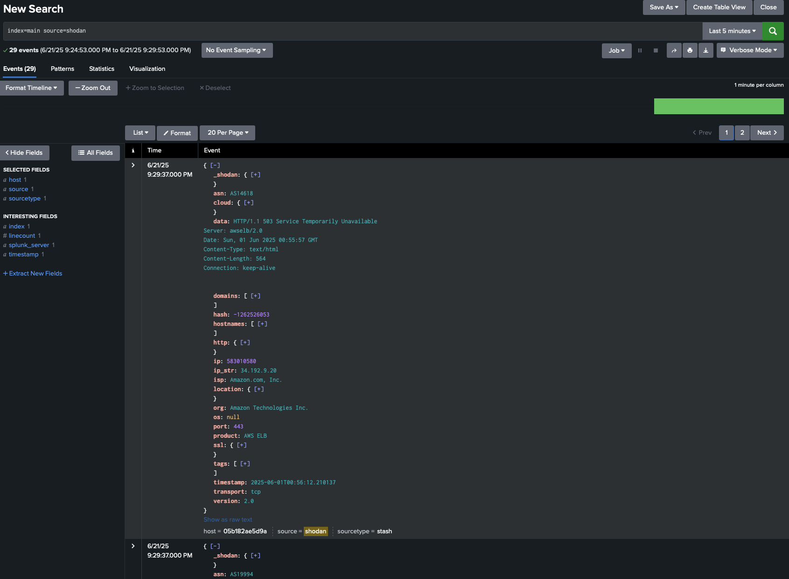
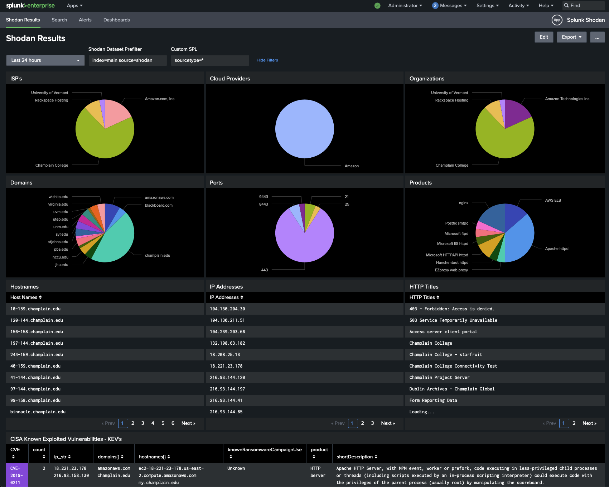

# Custom Splunk Shodan Command
This is a quick and dirty custom Splunk command to take a search query and retreive the results from Shodan's API. Results are returned directly in Splunk where they can be further processed.

Only setup required is dropping your API key in the shodan_configuration.csv lookup which is already present in the app. From there, follow the syntax below to use :)

> | shodan search_string="<SEARCH_STRING>"

## Demo

The command can be used to search Shodan and return the results in json format to the `data` field

---

Passing a `collect` command after the `shodan` command allows you to save the output data to an index where it can be further searched and extracted

---

Data saved to an index will appear in the natural json format, you may choose to do additional extractions via spath to search specific field data

---

See above for an example dataset in the sample dashboard. The source code for this dashboard is provided in this repository if you need something to get you started :)

> NOTE: If you are using `spath` to parse out large results you may need to create a local limits.conf file and specify a higher `extraction_cutoff` value to prevent clipping of data. This process is described here: https://docs.splunk.com/Documentation/Splunk/9.4.2/SearchReference/Spath

## Radical Tips for Attack Surface Management

If you're a real pro, you've installed this Shodan command in Splunk and set up a scheduled search to run it weekly or even daily to pull fresh data in from Shodan for your domains and/or IP space and collect it into a stash index. This is now a great hunting ground for random searching but you know what one of the easiest wins out there is? `CISA's Known Exploited Vulnerability Catalogue`, or `KEV` for short. This is an updated list of CVE's known to be exploited in the wild and serves as a list of vulnerabilities for organizations to prioritize patching. 

By now you probably know where I'm going with this. We need to grab a copy of the latest CSV version of the KEV and we could certainly do this manually and upload it as a lookup in Splunk except I'm way ahead of you on that front. I've already included an `updatelookup` command in this app and if you've installed it you can use the command below to pull the KEV down right in Splunk:
> | updatelookup url="https://www.cisa.gov/sites/default/files/csv/known_exploited_vulnerabilities.csv" lookup_name="kev"
For bonus points, add that logic to a scheduled search that runs daily and you'll have the fresh-est CSV in town.

Once that's done we can extract any CVE's present in your ASM data on the fly and see if any line up with those on CISA's naughty list and that's what should get your attention first.

> index=main source=shodan 
> | spath 
> | rex field=_raw "(?<CVE>CVE-[0-9]{4}-[0-9]*)" max_match=10000000 
> | stats values(CVE) AS CVE 
> | mvexpand CVE 
> | lookup kev.csv cveID AS CVE OUTPUT shortDescription product knownRansomwareCampaignUse 
> | where isnotnull(shortDescription)

Above is an example of where the sample dataset had some matches for CVE's on CISA's KEV. I'm not showing the actual IPs/Domains for obvious reasons but this is a very easy win in managing high-risk items in your attack surface. This logic can easily be modified into a Splunk alert so you can get pinged if something shows up 6 months from now, just be sure to keep that KEV lookup updated, it gets new CVE's added from time to time. 

Happy Hunting :)
